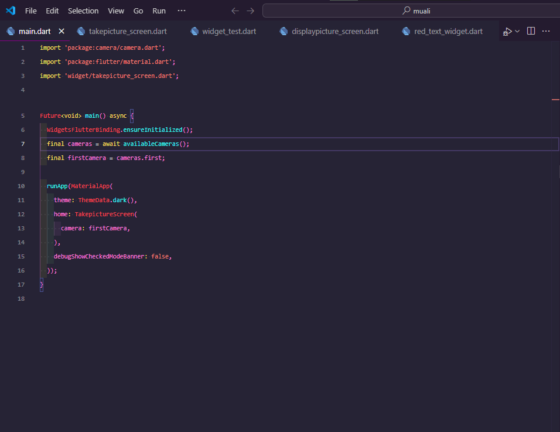
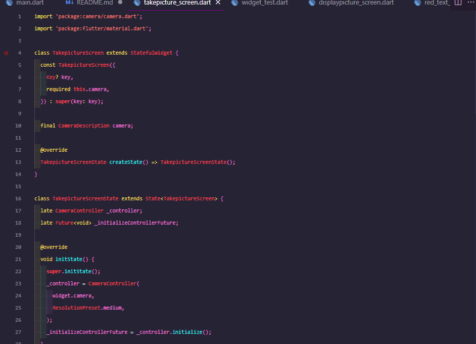
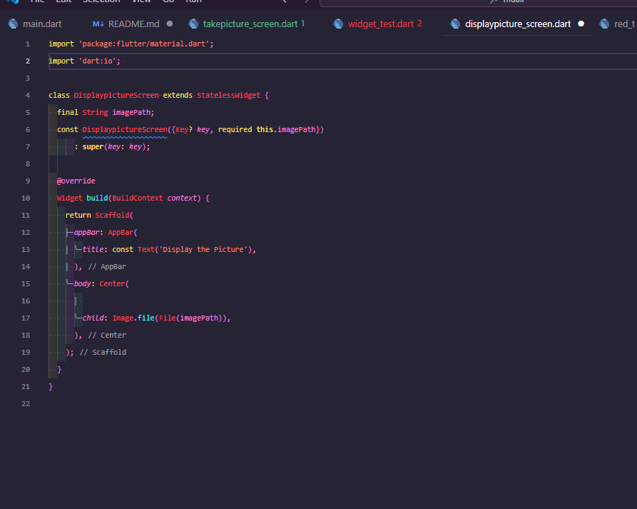
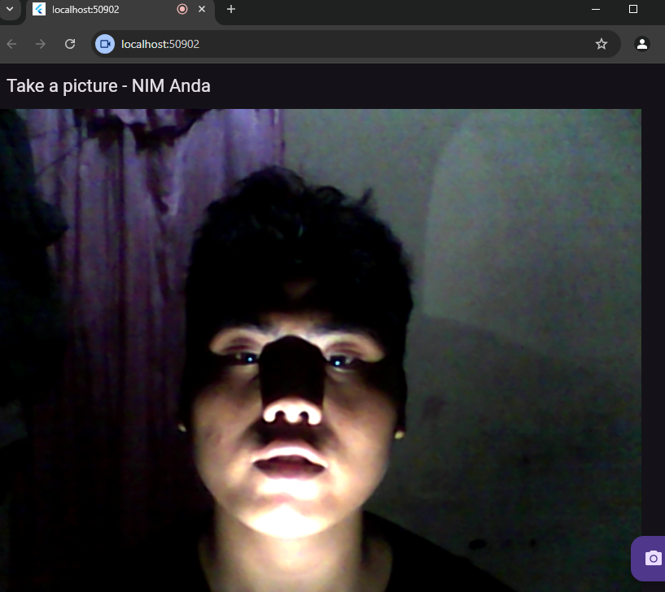

gambar di atas meripakan code main yang nanti nya akan menjalankan semua file

gambar di atas merupakan code take picture yang menagkap kamera

gambar di atas erupakan code dari file display picture

gambar di atas adalah hasil dari pengcodingan yang menampilkan camea pada device yang telah terhubung pada code nya